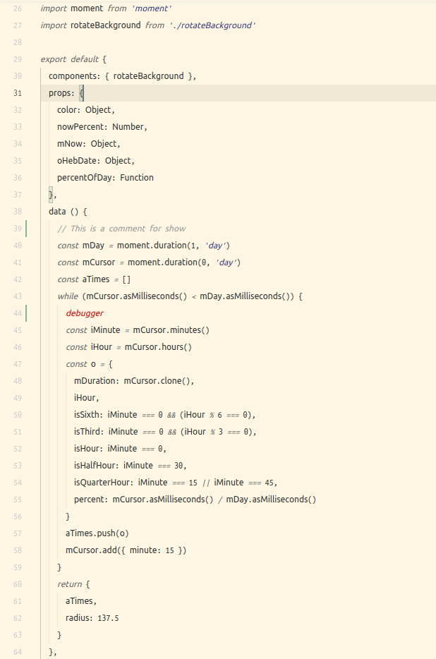

# VSCode Theme Sandy Desert
A sandy plain theme inspired by solarized light and a time when people would write scrolls on animal skins lost in the sands of time. Solarized and minimal.

## Features
+ Strings are purple like ink
+ Keywords like const etc are in itallics
+ Comments are grey
+ And debugger is red, should help with removing debugger statements from code.

## Disclaimer
Use how you like, if you don't like fork and make your own theme (It's what I did).